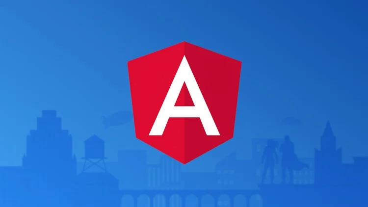

# Angular Zero to Expert Legacy - Fernando Herrera 35h

Everything you need to know about Angular using TypeScript and best practices offered by the Angular team. Find the course [here](https://www.udemy.com/course/angular-2-fernando-herrera/?couponCode=ST12MT122624).

After completing the course and working with this repository, you will:

* Have a solid foundation for working with Angular: Learn how Angular works and understand the architecture behind it.
* Master TypeScript for Angular applications: Gain proficiency in TypeScript, which is essential for building Angular applications.
* Apply new ECMAScript 6 (ES6) concepts in your Angular projects: Learn how to leverage ES6 features to improve your code.
* Create Angular applications following best practices: Build applications with clean and efficient code, following industry standards and Angular best practices.
* Build basic Ionic applications and run them on your mobile device (no developer account needed): Learn how to create cross-platform mobile apps using Angular and Ionic.
* Master Angular Directives, Pipes, Components, Services, and the structure of an Angular application: Understand how to use Angular's core features effectively to build scalable apps.